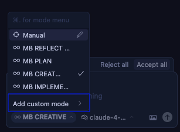
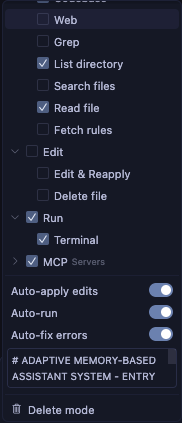
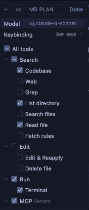
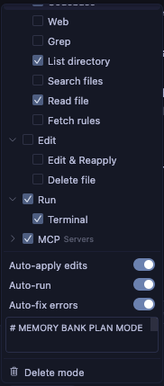
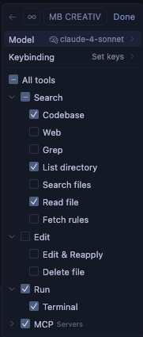

# Memory Bank 系统 v0.7-beta

一个令牌优化的分层任务管理系统，与 Cursor 自定义模式集成，实现高效的开发工作流。


> **个人说明**：Memory Bank 是我开发的个人爱好项目，用于我自己的编程项目。作为个人项目，我不维护问题跟踪器或主动收集反馈。但是，如果您在使用这些规则时遇到问题，一个很大的优势是您可以直接要求 Cursor AI 修改或更新规则以更好地适应您的特定工作流。该系统设计为可由 AI 适应，允许您根据自己的需求进行定制，而无需外部支持。

## 关于 Memory Bank

Memory Bank 是一个个人项目，为开发过程的不同阶段使用专门模式提供结构化的开发方法。它使用分层规则加载架构，仅加载每个阶段所需的规则，优化令牌使用并提供定制指导。

### 令牌优化架构

版本 0.7-beta 引入了显著的令牌优化改进：

- **分层规则加载**：仅初始加载基本规则，专门延迟加载
- **渐进式文档**：实现随任务复杂性扩展的简洁模板
- **优化的模式转换**：在模式间高效保存关键上下文
- **特定级别的工作流**：根据任务复杂性调整文档要求

有关所有优化方法的详细信息，请参阅 [Memory Bank 优化](MEMORY_BANK_OPTIMIZATIONS.md) 文档。

### 超越基本自定义模式

虽然 Cursor 的文档将自定义模式主要描述为具有基本提示和工具选择的独立配置，但 Memory Bank 显著扩展了这个概念：

- **基于图的模式集成**：模式是开发工作流中相互连接的节点，而不是孤立的工具
- **工作流进展**：模式设计为按逻辑顺序从一个转换到另一个（VAN → PLAN → CREATIVE → IMPLEMENT → REFLECT → ARCHIVE）
- **共享内存**：通过 Memory Bank 文件在模式转换间维护持久状态
- **自适应行为**：每个模式根据项目复杂性调整其建议
- **内置 QA 功能**：可以从任何模式调用 QA 能力进行技术验证

这种方法将自定义模式从简单的 AI 个性转换为协调开发系统的组件，具有专门阶段协同工作。

### CREATIVE 模式和 Claude 的"Think"工具

Memory Bank 中的 CREATIVE 模式在概念上基于 Anthropic 的 Claude "Think" 工具方法论，如其[工程博客](https://www.anthropic.com/engineering/claude-think-tool)中所述。v0.7-beta 实现了优化版本：

- 具有表格选项比较的渐进式文档
- 保持令牌效率的"按需详细"方法
- 随复杂性级别扩展的结构化模板
- 为实现阶段高效保存上下文

有关 Memory Bank 如何实现这些原则的详细解释，请参阅 [CREATIVE 模式和 Claude 的"Think"工具](creative_mode_think_tool.md) 文档。

## 关键特性

- **分层规则加载**：仅加载基本规则，专门延迟加载
- **渐进式文档**：随任务复杂性扩展的简洁模板
- **统一上下文传输**：模式间的高效上下文保存
- **模式特定的可视化图表**：每个开发阶段的清晰可视化表示
- **特定级别的工作流**：基于复杂性的适应流程（级别 1-4）
- **平台感知命令**：自动适应您的操作系统

## 安装说明

### 先决条件

- **Cursor 编辑器**：需要版本 0.48 或更高版本。
- **自定义模式**：必须在 Cursor 中启用该功能（设置 → 功能 → 聊天 → 自定义模式）。


- **AI 模型**：建议使用 Claude 4 Sonnet 或 Claude 4 Opus 以获得最佳结果，特别是对于 CREATIVE 模式的"Think"工具方法论。

### 步骤 1：获取文件

只需将此存储库克隆到您的项目目录：

```
git clone https://github.com/vanzan01/cursor-memory-bank.git
```

#### 替代方法（手动）

从 ZIP 文件解压后，按照以下步骤操作。

- 将 `.cursor` 和 `custom_modes` 文件夹复制到项目目录

注意：其他文档对于 memory bank 操作不是必需的，它们是说明文档。您可以将它们复制到像 `memory_bank_documents` 这样的文件夹中。

### 步骤 2：在 Cursor 中设置自定义模式

**这是设置中最关键和最具挑战性的部分。** 您需要在 Cursor 中手动创建六个自定义模式，并从提供的文件中复制指令内容：

#### 如何在 Cursor 中添加自定义模式

1. 打开 Cursor 并点击聊天面板中的模式选择器
2. 选择"添加自定义模式"


3. 在配置屏幕中：
   - 输入模式名称（您可以通过在名称开头复制粘贴来包含表情符号图标，如 🔍、📋、🎨、⚒️）
   - 从 Cursor 的有限预定义选项中选择图标
   - 添加快捷方式（可选）
   - 检查所需工具
   - 点击**高级选项**
   - 在底部出现的空文本框中，粘贴相应文件中的自定义指令内容

#### 模式配置

为每个模式配置如下（如果显示 MCP，您可以保持开启，它们可能不会工作）：

<table>
  <tr>
    <td align="center"><em>示例配置屏幕：</em></td>
    <td align="center"><em>模式选择菜单中的结果：</em></td>
  </tr>
  <tr>
    <td valign="top">
      
    </td>
    <td valign="top">
      
    </td>
  </tr>
</table>

1. **VAN 模式**（初始化）
   - **名称**：🔍 VAN
   - **工具**：启用"代码库搜索"、"读取文件"、"终端"、"列出目录"
   - **高级选项**：从 `custom_modes/van_instructions.md` 粘贴


 

2. **PLAN 模式**（任务规划）
   - **名称**：📋 PLAN
   - **工具**：启用"代码库搜索"、"读取文件"、"终端"、"列出目录"
   - **高级选项**：从 `custom_modes/plan_instructions.md` 粘贴

 

3. **CREATIVE 模式**（设计决策）
   - **名称**：🎨 CREATIVE
   - **工具**：启用"代码库搜索"、"读取文件"、"终端"、"列出目录"、"编辑文件"
   - **高级选项**：从 `custom_modes/creative_instructions.md` 粘贴

 

4. **IMPLEMENT 模式**（代码实现）
   - **名称**：⚒️ IMPLEMENT
   - **工具**：启用所有工具
   - **高级选项**：从 `custom_modes/implement_instructions.md` 粘贴

 

5. **REFLECT & ARCHIVE 模式**（回顾）
   - **名称**：🔍 REFLECT 或 ARCHIVE
   - **工具**：启用"代码库搜索"、"读取文件"、"终端"、"列出目录"
   - **高级选项**：从 `custom_modes/reflect_archive_instructions.md` 粘贴

 

> **注意**：REFLECT 和 ARCHIVE 指令合并在单个文件中，以优化 Cursor 的字符限制，同时保持功能。感谢 GitHub 用户 @joshmac007 实现了这个优化。

有关在 Cursor 中设置自定义模式的额外帮助，请参阅 [Cursor 自定义模式官方文档](https://docs.cursor.com/chat/custom-modes)。

### QA 功能

QA 不是单独的自定义模式，而是一组可以从任何模式调用的验证功能。当您需要执行技术验证时，可以在任何模式中输入"QA"来调用 QA 能力。这种方法提供了在开发过程的任何时点进行验证的灵活性。

## 基本使用

1. **从 VAN 模式开始**：
   - 在 Cursor 中切换到 VAN 模式
   - 输入"VAN"启动初始化过程
   - VAN 将分析您的项目结构并确定复杂性

2. **根据复杂性遵循工作流**：
   - **级别 1 任务**：可能在 VAN 后直接进入 IMPLEMENT
   - **级别 2 任务**：简化工作流（VAN → PLAN → IMPLEMENT → REFLECT）
   - **级别 3-4 任务**：完整工作流（VAN → PLAN → CREATIVE → IMPLEMENT → REFLECT → ARCHIVE）
   - **任何时点**：输入"QA"执行技术验证


      

3. **模式特定命令**：
   ```
   VAN - 初始化项目并确定复杂性
   PLAN - 创建详细的实现计划
   CREATIVE - 为复杂组件探索设计选项
   IMPLEMENT - 系统性地构建计划的组件
   REFLECT - 回顾并记录经验教训
   ARCHIVE - 创建全面的文档
   QA - 验证技术实现（可从任何模式调用）
   ```

4. **开始使用您的项目**：
   
成功安装 Memory Bank 后...

## 核心文件及其用途


- **tasks.md**：任务跟踪的中央真实来源
- **activeContext.md**：维护当前开发阶段的焦点
- **progress.md**：跟踪实现状态
- **creative-*.md**：CREATIVE 模式期间生成的设计决策文档
- **reflect-*.md**：REFLECT 模式期间创建的回顾文档

## 故障排除

### 常见问题

1. **模式响应不正确**：
   - 验证自定义指令是否完整复制（这是最常见的问题）
   - 确保为每个模式启用了正确的工具
   - 检查在发出命令之前是否已切换到正确的模式
   - 确保您在"高级选项"文本框中粘贴了指令

2. **规则未加载**：
   - 确保 `.cursor/rules/isolation_rules/` 目录在正确位置
   - 验证文件权限允许读取规则文件

3. **命令执行问题**：
   - 确保您从正确的目录运行命令
   - 验证平台特定命令是否正确使用

## 版本信息

这是 Memory Bank 系统的 v0.7-beta 版本。它在保持所有功能的同时，相比 v0.6-beta 引入了显著的令牌优化改进。有关更改的详细信息，请参阅 [发布说明](RELEASE_NOTES.md)。

### 持续开发

Memory Bank 系统正在积极开发和改进中。要理解的关键点：

- **进行中的工作**：这是一个具有持续开发的 beta 版本。期待定期更新、优化和新功能。
- **功能优化**：模块化架构使得能够在不破坏现有功能的情况下持续改进。
- **可用的先前版本**：如果您更喜欢先前版本的稳定性（v0.1-legacy），您可以在此版本成熟时继续使用它。
- **架构优势**：在决定使用哪个版本之前，请阅读 [Memory Bank 升级指南](memory_bank_upgrade_guide.md) 以了解新架构的显著优势。

## 资源

- [Memory Bank 优化](MEMORY_BANK_OPTIMIZATIONS.md) - 令牌效率改进的详细概述
- [发布说明](RELEASE_NOTES.md) - 最新更改的信息
- [Cursor 自定义模式文档](https://docs.cursor.com/chat/custom-modes)
- [Memory Bank 升级指南](memory_bank_upgrade_guide.md)
- [CREATIVE 模式和 Claude 的"Think"工具](creative_mode_think_tool.md)
- `custom_modes/` 目录中的模式特定指令文件

---

*注意：此 README 适用于 v0.7-beta，随着系统的发展可能会发生变化。*
