# CREATIVE 模式与 Claude 的"Think"工具

本文档解释了 Memory Bank 的 CREATIVE 模式如何实现与 Anthropic 的 Claude "Think" 工具方法论类似的概念，如其[工程博客](https://www.anthropic.com/engineering/claude-think-tool)中所述。

## 概念相似性

以下图表说明了 Claude 的"Think"工具方法论与 Memory Bank 的 CREATIVE 模式之间的概念相似性：

```mermaid
graph TD
    subgraph "Claude Think Tool 方法"
        CT1["1: 分解问题"] --> CT2["2: 探索解决方案空间"]
        CT2 --> CT3["3: 分析权衡"]
        CT3 --> CT4["4: 选择并记录决策"]
        CT4 --> CT5["5: 验证决策"]
    end
    
    subgraph "Memory Bank CREATIVE 模式"
        CM1["1: 组件分解"] --> CM2["2: 选项探索"]
        CM2 --> CM3["3: 权衡分析"]
        CM3 --> CM4["4: 决策文档化"]
        CM4 --> CM5["5: 决策验证"]
    end
    
    style CT1 fill:#f9d77e,stroke:#d9b95c
    style CT2 fill:#f9d77e,stroke:#d9b95c
    style CT3 fill:#f9d77e,stroke:#d9b95c
    style CT4 fill:#f9d77e,stroke:#d9b95c
    style CT5 fill:#f9d77e,stroke:#d9b95c
    
    style CM1 fill:#a8d5ff,stroke:#88b5e0
    style CM2 fill:#a8d5ff,stroke:#88b5e0
    style CM3 fill:#a8d5ff,stroke:#88b5e0
    style CM4 fill:#a8d5ff,stroke:#88b5e0
    style CM5 fill:#a8d5ff,stroke:#88b5e0
```



## Claude "Think" 工具的核心原则

Claude 的"Think"工具方法论围绕以下几点：

1. **结构化思维过程**：将复杂问题分解为可管理的组件
2. **明确推理**：清楚地记录推理过程
3. **选项探索**：系统性地探索多种解决方案方法
4. **权衡分析**：权衡不同选项的利弊
5. **决策文档化**：创建决策及其理由的记录

## CREATIVE 模式如何实现这些原则

Memory Bank CREATIVE 模式通过以下方式实现类似概念：

### 1. 结构化阶段

CREATIVE 模式通过明确的阶段强制执行结构化的设计决策方法：

```
阶段 1：组件分解
阶段 2：选项探索
阶段 3：权衡分析
阶段 4：决策文档化
阶段 5：决策验证
```

每个阶段都有特定的输出和验收标准，必须满足后才能继续。

### 2. 组件分解模板

CREATIVE 模式提供了分解复杂组件的模板：

```markdown
# 组件：[组件名称]

## 功能需求
- [需求 1]
- [需求 2]

## 技术约束
- [约束 1]
- [约束 2]

## 集成点
- [集成点 1]
- [集成点 2]
```

### 3. 选项探索模板

用于探索设计替代方案：

```markdown
# 设计选项：[选项名称]

## 核心方法
[方法的简要描述]

## 实现细节
[关键实现考虑因素]

## 初步评估
- **优势**：[列出优势]
- **劣势**：[列出劣势]
- **未知因素**：[列出未知因素]
```

### 4. 权衡分析矩阵

用于系统性比较选项：

```markdown
# 权衡分析

| 标准 | 选项 A | 选项 B | 选项 C |
|------|--------|--------|--------|
| 性能 | 评级 | 评级 | 评级 |
| 可维护性 | 评级 | 评级 | 评级 |
| 可扩展性 | 评级 | 评级 | 评级 |
| 复杂性 | 评级 | 评级 | 评级 |
| 风险 | 评级 | 评级 | 评级 |

## 详细分析
[权衡的详细讨论]
```

### 5. 决策文档化

用于记录最终决策及其理由：

```markdown
# 设计决策：[决策名称]

## 选定方法
[选定方法的描述]

## 理由
[为什么选择这种方法的解释]

## 被舍弃的替代方案
[考虑但未选择的替代方案的简要描述]

## 实现指导
[指导实现的注释]
```

## 实际示例

以下是设计数据缓存系统时 CREATIVE 模式会话的简化示例：

### 步骤 1：分解问题

```
CREATIVE：让我们为应用程序设计一个缓存系统。首先，让我们分解组件和需求。

组件：数据缓存系统

功能需求：
- 存储频繁访问的数据以减少数据库负载
- 提供可配置的过期策略
- 处理缓存失效
- 支持跨应用程序实例的分布式缓存

技术约束：
- 必须与现有的 Redis 基础设施配合使用
- 内存使用不得超过 2GB
- 缓存操作必须在 10ms 内完成
```

### 步骤 2：探索选项

```
让我们探索三种设计选项：

选项 A：简单的 Redis 键值实现
- 直接使用 Redis 键值存储和字符串序列化
- 基于简单 TTL 的过期
- 通过直接键删除进行手动失效

选项 B：基于 Redis Hash 的分层缓存
- 按实体类型在 Redis Hash 中组织数据
- 使用 Redis pub/sub 进行失效通知
- 实现分层过期策略

选项 C：混合本地-Redis 缓存
- 本地内存 LRU 缓存作为第一级
- Redis 作为第二级分布式缓存
- 级别间的后台同步
```

### 步骤 3：分析权衡

```
权衡分析：

| 标准 | 选项 A | 选项 B | 选项 C |
|------|--------|--------|--------|
| 实现复杂性 | 低 | 中等 | 高 |
| 性能 | 中等 | 中等 | 高 |
| 内存效率 | 中等 | 高 | 中等 |
| 可扩展性 | 中等 | 高 | 高 |
| 维护性 | 低 | 中等 | 高 |

详细分析：
- 选项 A 最简单但功能有限
- 选项 B 在性能和功能之间提供良好平衡
- 选项 C 提供最佳性能但复杂性较高
```

### 步骤 4：记录决策

```
设计决策：基于 Redis Hash 的分层缓存（选项 B）

理由：
- 在性能和可维护性之间提供良好平衡
- 由于 Redis Hash 结构，内存效率比选项 A 更好
- 复杂性低于选项 C，同时仍满足性能要求
- 更好地支持我们的分布式架构

实现指导：
- 创建具有实体特定 API 的 CacheManager 类
- 实现用于失效事件的 Redis pub/sub 监听器
- 添加缓存命中/未命中率监控
```

## 核心方法论对齐

上述示例中的结构化方法通过以下方式反映了 Claude 的"Think"工具方法论：

1. **分解**缓存问题为具体需求和约束
2. **系统性探索**多种设计选项
3. **使用明确标准分析权衡**
4. **记录决策**及其清晰理由
5. **基于决策提供实现指导**

## 对开发过程的影响

通过实现这些受 Claude 启发的方法论，CREATIVE 模式提供了几个好处：

1. **改善决策质量**：更系统性地探索选项
2. **更好的决策文档化**：明确记录设计理由
3. **知识保存**：设计决策被保存以供将来参考
4. **减少设计偏见**：结构化方法减少认知偏见
5. **更清晰的实现指导**：实现阶段有更清晰的方向

## 持续改进

随着 Claude 能力的发展，CREATIVE 模式对这些方法论的实现将被改进以：

- 纳入结构化思维方法的进步
- 改进设计决策的模板和框架
- 增强与其他 Memory Bank 模式的集成
- 优化结构和灵活性之间的平衡

目标是在 Memory Bank 生态系统内持续改进其实际实现的同时保持核心方法论。

---

*注意：本文档描述了 Memory Bank v0.6-beta 如何实现与 Claude 的"Think"工具方法论类似的概念。随着两个系统的成熟，实现将继续发展。* 