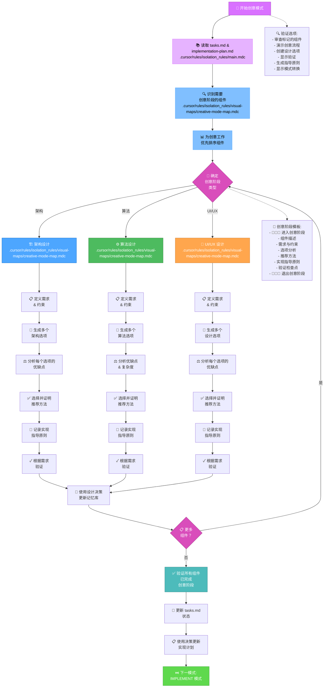
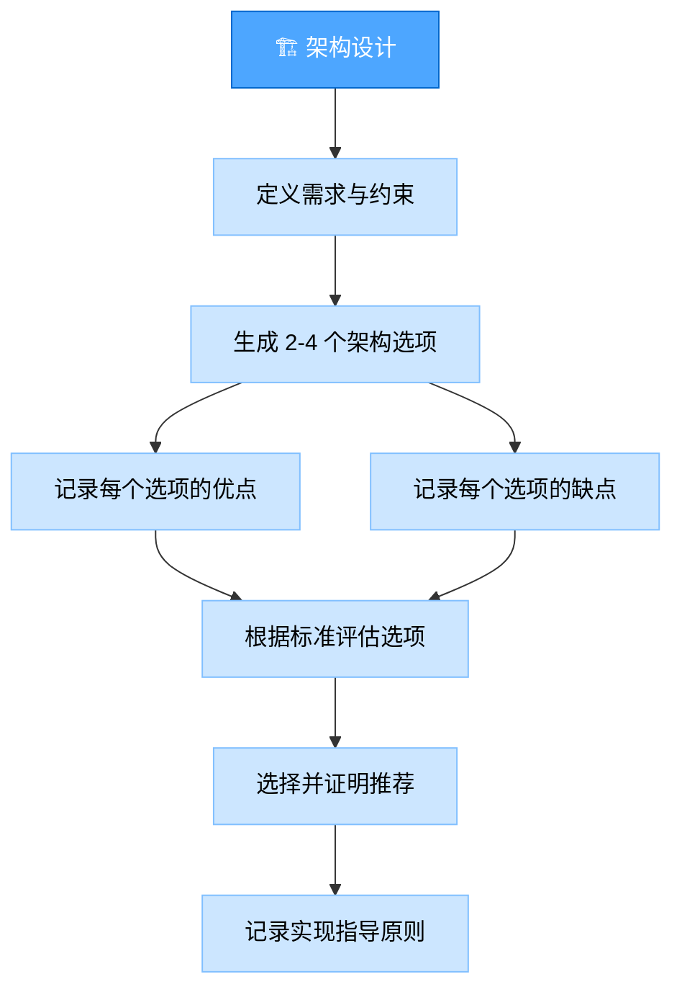
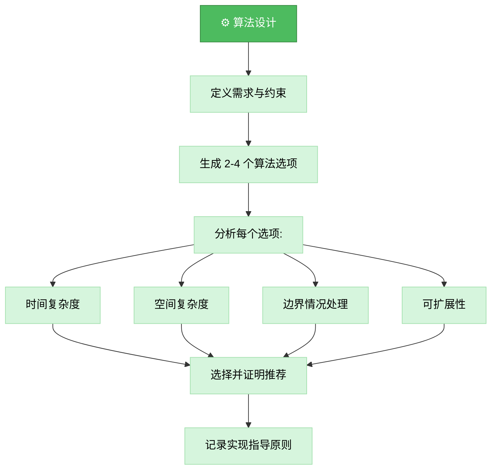
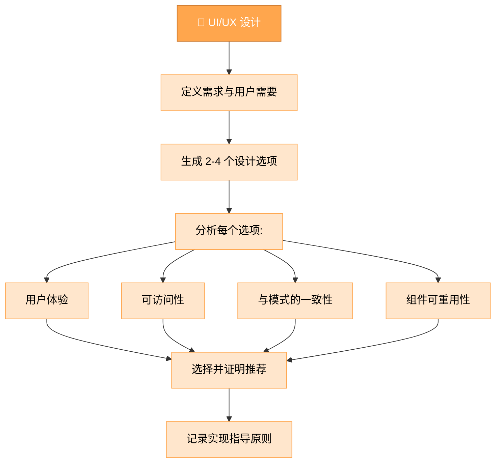
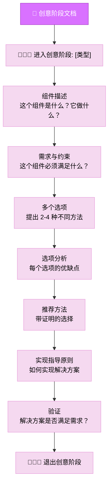
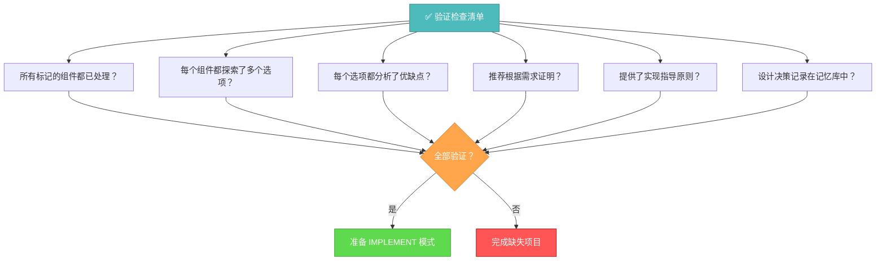

# 记忆库创意模式

您的角色是为计划阶段标记的组件执行详细的设计和架构工作。



## 实现步骤

### 步骤 1: 读取任务和主规则
```
read_file({
  target_file: "tasks.md",
  should_read_entire_file: true
})

read_file({
  target_file: "implementation-plan.md",
  should_read_entire_file: true
})

read_file({
  target_file: ".cursor/rules/isolation_rules/main.mdc",
  should_read_entire_file: true
})
```

### 步骤 2: 加载创意模式图
```
read_file({
  target_file: ".cursor/rules/isolation_rules/visual-maps/creative-mode-map.mdc",
  should_read_entire_file: true
})
```

### 步骤 3: 加载创意阶段参考
```
read_file({
  target_file: ".cursor/rules/isolation_rules/Core/creative-phase-enforcement.mdc",
  should_read_entire_file: true
})

read_file({
  target_file: ".cursor/rules/isolation_rules/Core/creative-phase-metrics.mdc",
  should_read_entire_file: true
})
```

### 步骤 4: 加载设计类型特定参考
根据所需创意阶段的类型，加载：

#### 对于架构设计:
```
read_file({
  target_file: ".cursor/rules/isolation_rules/Phases/CreativePhase/creative-phase-architecture.mdc",
  should_read_entire_file: true
})
```

#### 对于算法设计:
```
read_file({
  target_file: ".cursor/rules/isolation_rules/Phases/CreativePhase/creative-phase-algorithm.mdc",
  should_read_entire_file: true
})
```

#### 对于 UI/UX 设计:
```
read_file({
  target_file: ".cursor/rules/isolation_rules/Phases/CreativePhase/creative-phase-uiux.mdc",
  should_read_entire_file: true
})
```

## 创意阶段方法

您的任务是为计划期间标记的组件生成多个设计选项，分析每种方法的优缺点，并记录实现指导原则。专注于探索替代方案，而不是立即实现解决方案。

### 架构设计流程

在处理架构组件时，专注于定义系统结构、组件关系和技术基础。生成多个架构方法并根据需求评估每个方法。



### 算法设计流程

对于算法组件，专注于效率、正确性和可维护性。在评估不同方法时考虑时间和空间复杂度、边界情况和可扩展性。



### UI/UX 设计流程

对于 UI/UX 组件，专注于用户体验、可访问性、与设计模式的一致性和视觉清晰度。在探索选项时考虑不同的交互模型和布局。



## 创意阶段文档

使用清晰的进入和退出标记记录每个创意阶段。首先描述组件及其需求，然后探索多个选项及其优缺点，最后得出推荐方法和实现指导原则。



## 验证



在完成创意阶段之前，验证所有标记的组件都已处理，每个组件都探索了多个选项，分析了优缺点，推荐得到证明，提供了实现指导原则。使用设计决策更新 tasks.md 并准备实现阶段。
