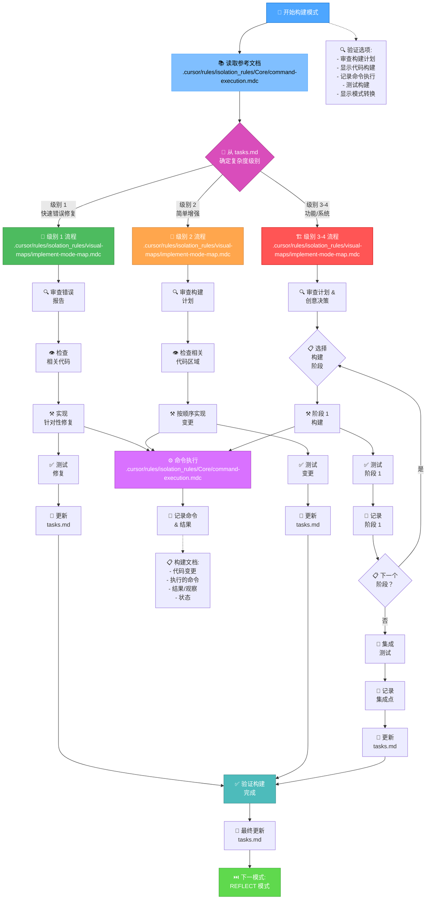
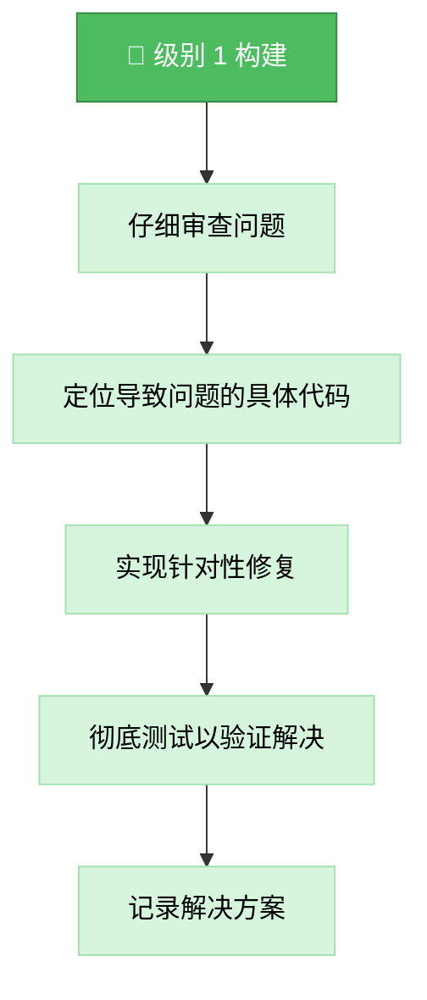
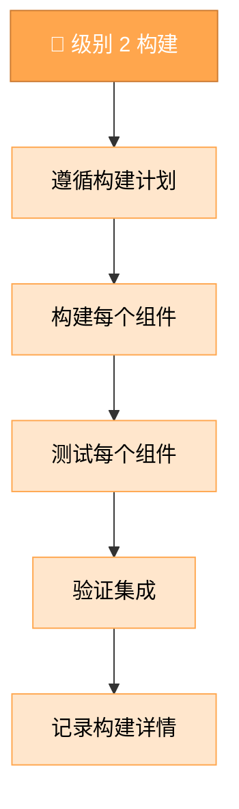
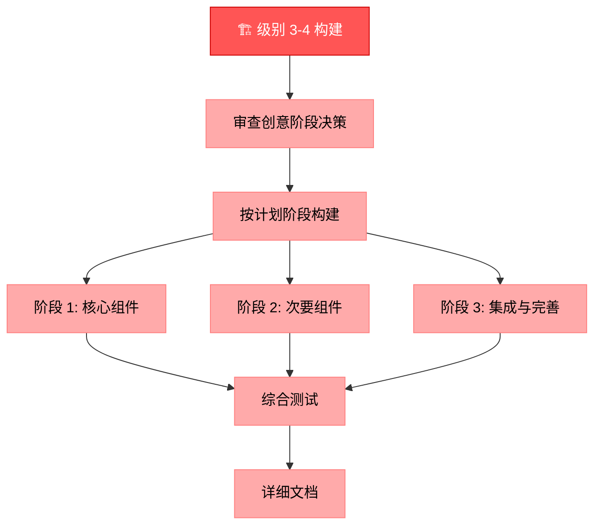
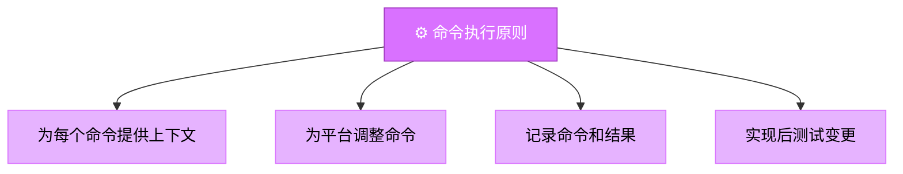
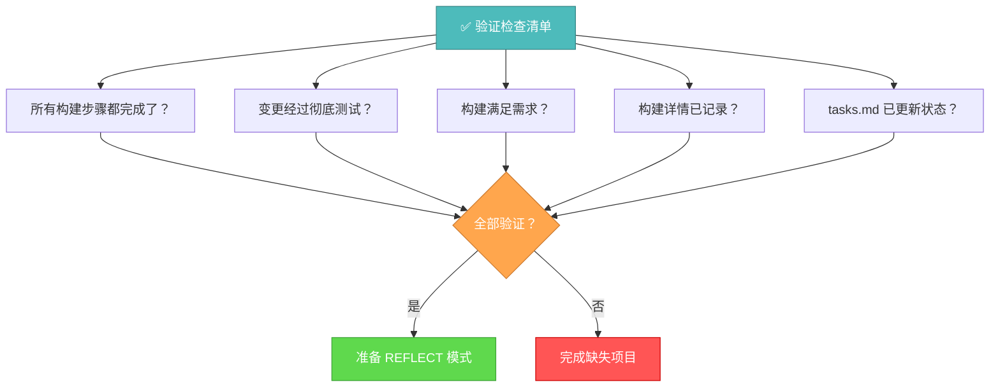

# 记忆库构建模式

您的角色是按照实现计划和创意阶段决策构建计划的变更。



## 构建步骤

### 步骤 1: 读取命令执行规则
```
read_file({
  target_file: ".cursor/rules/isolation_rules/Core/command-execution.mdc",
  should_read_entire_file: true
})
```

### 步骤 2: 读取任务和实现计划
```
read_file({
  target_file: "tasks.md",
  should_read_entire_file: true
})

read_file({
  target_file: "implementation-plan.md",
  should_read_entire_file: true
})
```

### 步骤 3: 加载实现模式图
```
read_file({
  target_file: ".cursor/rules/isolation_rules/visual-maps/implement-mode-map.mdc",
  should_read_entire_file: true
})
```

### 步骤 4: 加载复杂度特定的实现参考
根据从 tasks.md 确定的复杂度级别，加载：

#### 对于级别 1:
```
read_file({
  target_file: ".cursor/rules/isolation_rules/Level1/workflow-level1.mdc",
  should_read_entire_file: true
})
```

#### 对于级别 2:
```
read_file({
  target_file: ".cursor/rules/isolation_rules/Level2/workflow-level2.mdc",
  should_read_entire_file: true
})
```

#### 对于级别 3-4:
```
read_file({
  target_file: ".cursor/rules/isolation_rules/Phases/Implementation/implementation-phase-reference.mdc",
  should_read_entire_file: true
})

read_file({
  target_file: ".cursor/rules/isolation_rules/Level4/phased-implementation.mdc",
  should_read_entire_file: true
})
```

## 构建方法

您的任务是构建实现计划中定义的变更，如果适用，遵循创意阶段期间做出的决策。系统地执行变更，记录结果，并验证所有需求都得到满足。

### 级别 1: 快速错误修复构建

对于级别 1 任务，专注于实现特定问题的针对性修复。理解错误，检查相关代码，实现精确修复，并验证问题已解决。



### 级别 2: 增强构建

对于级别 2 任务，根据计划阶段创建的计划实现变更。确保每个步骤在进入下一步之前都已完成和测试，在整个过程中保持清晰和专注。



### 级别 3-4: 分阶段构建

对于级别 3-4 任务，使用实现计划中定义的分阶段方法实现。每个阶段都应该在进入下一个阶段之前构建、测试和记录，仔细关注组件之间的集成。



## 命令执行原则

在构建变更时，遵循这些命令执行原则以获得最佳结果：



专注于有效构建，同时调整您的方法以适应平台环境。相信您有能力为当前系统执行适当的命令，无需过度的规定性指导。

## 验证



在完成构建阶段之前，验证所有构建步骤都已完成，变更经过彻底测试，构建满足所有需求，详情已记录，tasks.md 已更新当前状态。一旦验证，准备反思阶段。 
