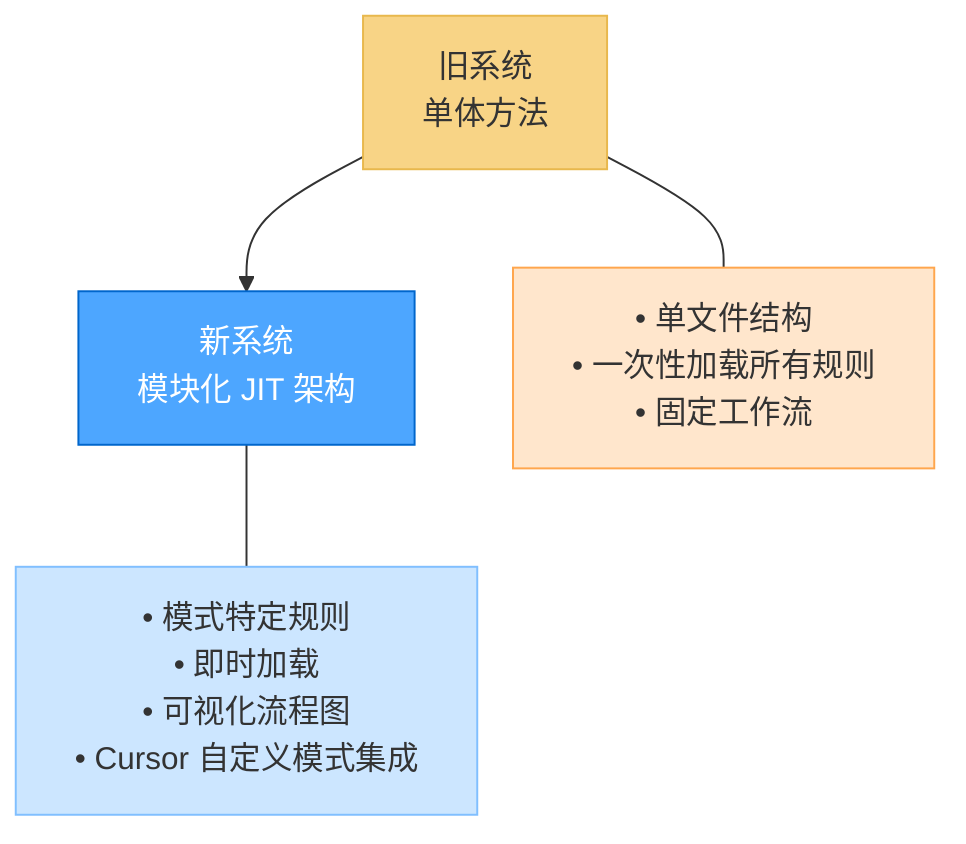
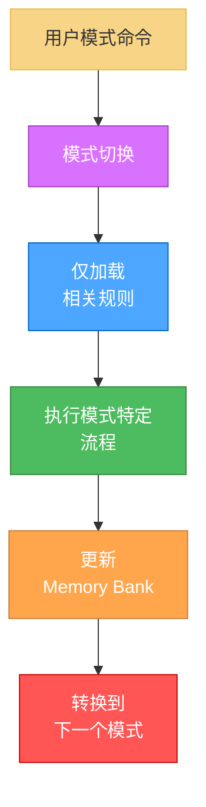
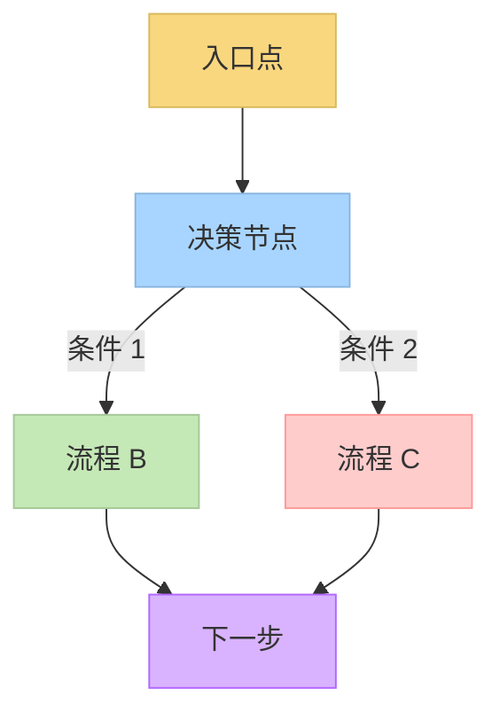
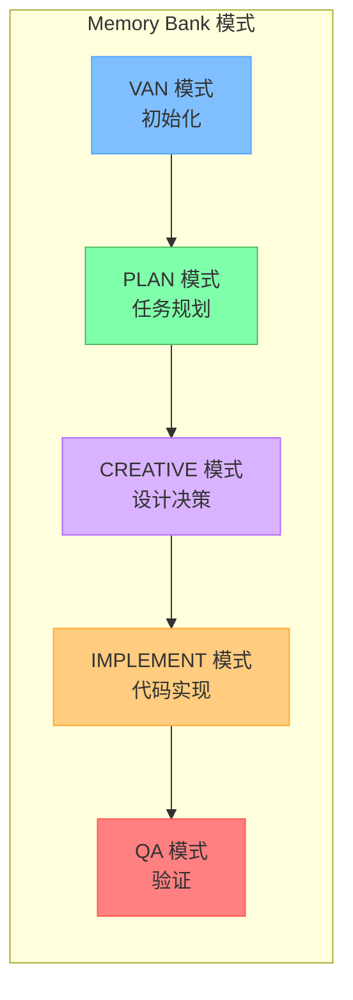
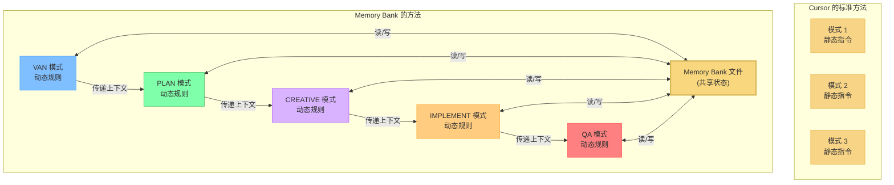
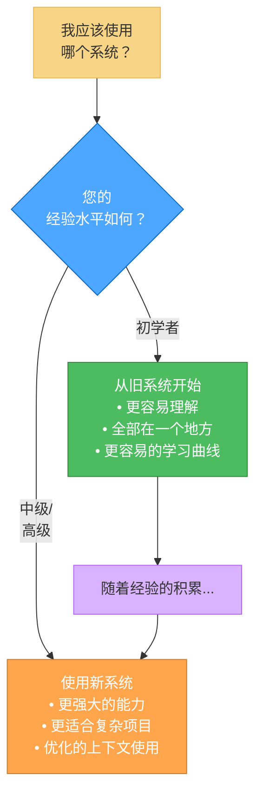
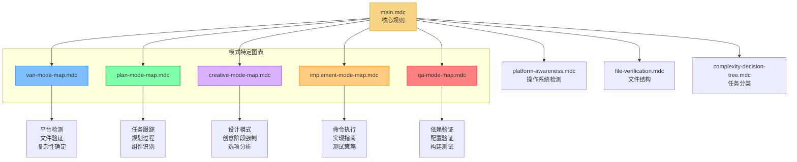
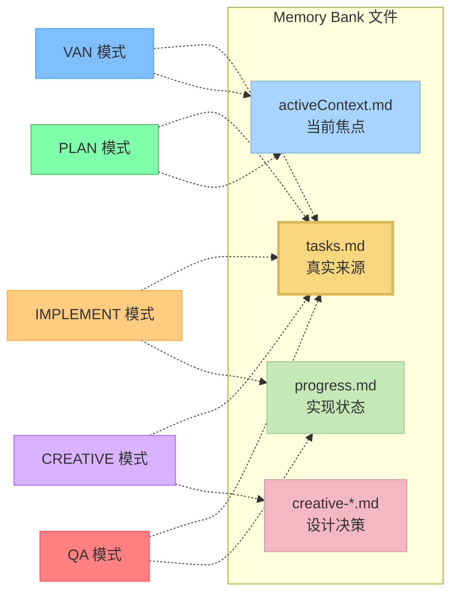
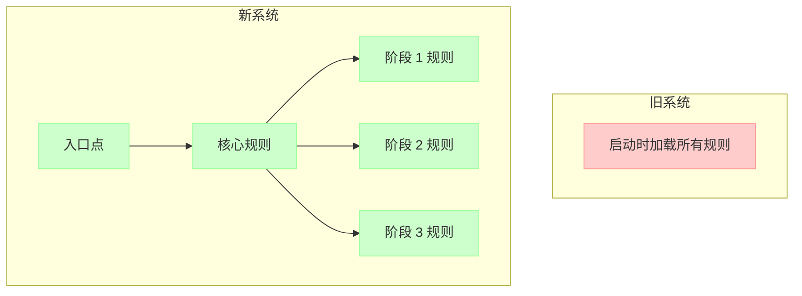
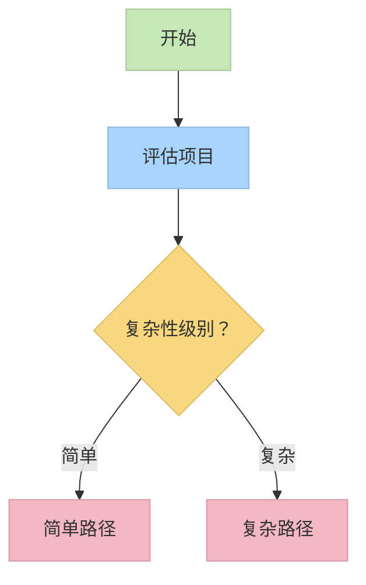

# Memory Bank 系统升级：从单体到模块化

## 介绍

我很高兴介绍 Memory Bank 系统的重大升级——从单体一体化方法演进为模块化、基于图的系统，与 Cursor 的自定义模式集成。本文档解释了这种转换的原因、好处以及如何充分利用新系统。



## 为什么要升级

旧的 Memory Bank 系统运行良好，通过其自适应复杂性级别和全面文档提供了结构化的任务管理方法。然而，随着项目复杂性的增长，我发现了几个限制：

1. **上下文效率低下**：无论相关性如何，一次性加载所有规则
2. **有限的视觉指导**：文本繁重的指令，缺乏可视化流程图
3. **令牌浪费**：用不相关的规则消耗上下文窗口
4. **一刀切方法**：对特定开发阶段的定制较少
5. **可扩展性挑战**：维护不断增长的单文件系统的困难

虽然新系统在效率和可扩展性方面提供了显著优势，但我承认它确实引入了更陡峭的学习曲线。这种权衡是有意的——增加的初始复杂性使得更强大的能力、更好的组织和改进的复杂项目长期开发结果成为可能。

## 新的隔离聚焦架构

新系统通过模块化、即时（JIT）架构解决了这些限制，该架构仅在需要时加载所需的规则。



重要的是，新系统保留了原始系统的基础 4 级复杂性量表。这个量表（级别 1：快速错误修复，级别 2：简单增强，级别 3：中级功能，级别 4：复杂系统）仍然是确定工作流路径和文档要求的核心，确保了熟悉原始方法的用户的连续性。

### 新系统的关键特性

1. **模式特定的可视化图表**：每个开发阶段的清晰可视化表示
2. **即时规则加载**：仅加载当前任务所需的规则
3. **可视化决策树**：带有清晰检查点的引导工作流
4. **技术验证**：专门的 QA 流程来验证实现准备情况
5. **平台感知命令**：自动适应您的操作系统

### 基于图的效率

新系统能力的基本推动因素是其基于图的架构：

- **优化路径导航**：系统使用有向图以最小开销导航复杂决策树
- **上下文关系**：图结构明确建模开发阶段和组件之间的关系，实现更智能的转换
- **资源优化**：图中的每个节点仅加载该特定步骤所需的资源
- **并行处理潜力**：图结构使识别可以并行处理的组件变得更容易



**之前**：具有冗余规则评估的线性执行路径。

**之后**：通过具有清晰条件和合并点的决策点进行优化遍历。

这种基于图的方法在处理大型复杂项目时特别有效，其中不同组件具有不同的要求和依赖关系。系统可以有效地导航这些复杂性，而不会压倒上下文窗口。

### CREATIVE 模式和 Claude 的"Think"工具

新系统的一个值得注意的方面是 CREATIVE 模式在概念上基于 Anthropic 的 Claude "Think" 工具方法论，如其[工程博客](https://www.anthropic.com/engineering/claude-think-tool)中所述。这种方法已被增强并集成到 Memory Bank 工作流中：

- **结构化探索**：CREATIVE 模式引导用户系统性地探索设计选项
- **明确推理**：要求为不同方法记录利弊
- **组件分解**：帮助将复杂问题分解为可管理的组件
- **决策文档化**：创建具有清晰理由的设计决策正式记录
- **持续改进**：随着 Claude 能力的进步，实现将继续发展

这种方法论已被证明对复杂设计决策特别有效，确保在开始实现之前彻底考虑所有选项。

## 与 Cursor 自定义模式的集成

新系统充分利用了 Cursor 的自定义模式功能，该功能允许为不同任务配置专门的 AI 行为。

### 什么是 Cursor 自定义模式？

Cursor 自定义模式允许您配置具有特定工具和自定义指令的不同 AI 行为。新的 Memory Bank 系统为每个开发阶段创建专门的模式：



每个模式仅加载其所需的规则集，优化上下文使用并提供专门指导：

| 模式 | 目的 | 关键特性 |
|------|------|----------|
| VAN | 初始化 | 平台检测、文件验证、复杂性确定 |
| PLAN | 任务规划 | 需求分析、组件识别、实现策略 |
| CREATIVE | 设计决策 | 多选项探索、利弊分析、设计建议 |
| IMPLEMENT | 代码实现 | 系统性构建、命令执行、测试 |
| QA | 技术验证 | 依赖验证、配置验证、构建测试 |

### 超越 Cursor 标准自定义模式实现

虽然 Cursor 的[自定义模式文档](https://docs.cursor.com/chat/custom-modes)主要将其描述为具有调整提示和工具选择的独立配置，但 Memory Bank 显著扩展了这个概念：

#### 标准 Cursor 自定义模式方法

根据 Cursor 的文档，自定义模式通常包括：
- 设置名称、图标和快捷方式
- 启用或禁用特定工具
- 添加自定义指令（提示）

他们的示例模式（教学、重构、计划等）作为独立配置运行，彼此之间没有固有连接。每个模式本质上是具有特定指令的独立 AI 个性。

#### Memory Bank 的增强自定义模式方法



Memory Bank 将自定义模式转换为一个全面的、相互连接的系统：

1. **基于图的架构**：
   - 模式表示开发工作流中具有明确转换的节点
   - 每个模式了解其在整体开发过程中的位置
   - 可视化流程图引导用户通过适当的序列

2. **工作流集成**：
   - 模式形成一个有凝聚力的开发过程（VAN → PLAN → CREATIVE → IMPLEMENT → QA）
   - 每个模式都知道前面和后续的模式
   - 模式间的转换通过特定的进入/退出标准正式化

3. **共享内存**：
   - 通过 Memory Bank 文件在模式转换间维护持久状态
   - Tasks.md 作为所有模式的中央真实来源
   - 每个模式向共享知识库贡献特定类型的信息

4. **即时规则加载**：
   - 每个模式动态加载仅其特定规则集
   - 规则专门针对当前开发阶段
   - 为生产性工作保留上下文窗口
   - 规则可以根据项目复杂性级别进行调整

5. **可视化流程图**：
   - 每个模式包含嵌入的 Mermaid 图表
   - 决策点和工作流选项的可视化指导
   - 跟踪每个阶段内进度的清晰检查点

6. **复杂性自适应行为**：
   - 模式根据初始化期间确定的复杂性级别调整其行为
   - 简单项目遵循简化流程
   - 复杂项目接受更全面的指导

### 这种方法的好处

这种增强的自定义模式方法提供了几个优势：

1. **改善上下文利用**：通过仅加载相关规则，更多上下文可用于实际开发工作
2. **连贯的开发过程**：模式作为统一系统而不是断开的工具一起工作
3. **阶段适当的指导**：每个开发阶段接受针对其需求优化的专门指导
4. **知识持久性**：重要信息在模式转换间得以保存
5. **减少认知开销**：开发人员可以专注于当前阶段，而不会被不相关的指导分散注意力

### 潜在的未来增强

如果这种方法通过测试证明成功，它可能会激发对自定义模式使用方式的几个增强：

1. **正式化模式转换**：开发阶段间更明确的交接
2. **增强的可视化指导**：更复杂的流程图和决策树
3. **与 Memory Bank 的更深集成**：为不同开发阶段提供更专门的文档类型
4. **自定义模式模板**：为不同项目类型预配置的模式序列
5. **团队协作**：跨多个团队成员协调使用模式

虽然与标准自定义模式相比，这种实现在设置上引入了更多复杂性，但它为结构化开发过程提供了显著更强大的能力。系统将自定义模式从孤立的 AI 行为转换为全面开发方法论的组件。

## 真实世界的好处：来自项目的证据

我对真实世界项目（包括复杂的 Todo 应用程序）的测试证明了新系统的显著好处：

1. **强制开发纪律**：模式切换创建了自然的阶段分离，减少了直接跳到实现的倾向
2. **全面文档**：每个模式产生具有明确设计决策的专门文档
3. **系统性开发**：组件按照计划以逻辑依赖顺序构建
4. **需要时的灵活性**：混合方法（如 IMPLEMENT 中的 QA）在不失去结构的情况下有效工作

来自分析文档：

> "我观察到模式间开发方法的明显差异。每个模式都成功地针对其特定的开发阶段进行了优化。最终应用程序的质量受益于这种结构化方法。"

## 比较：旧系统 vs 新系统

| 方面 | 旧系统 | 新系统 |
|------|--------|--------|
| **结构** | 单文件 | 多个专门文件 |
| **上下文使用** | 一次性加载所有内容 | 即时加载 |
| **指导** | 基于文本的指令 | 可视化流程图 + 文本 |
| **决策制定** | 基本决策点 | 全面决策树 |
| **技术验证** | 基本验证 | 专门的 QA 流程 |
| **平台感知** | 有限 | 全面适应 |
| **Memory Bank** | 相同的核心文件 | 相同的核心文件，改进组织 |
| **文档** | 标准化格式 | 模式特定的专门格式 |
| **复杂性级别** | 4 级量表 | 相同的 4 级量表，增强流程 |

## 何时使用每个系统



### 尝试新系统的指导原则

- **新项目**：新系统在开始新项目时效果最佳，而不是转换现有项目
- **测试方法**：如果您想在现有项目上尝试，请先备份并在安全环境中实验
- **无正式迁移路径**：我没有开发从旧系统到新系统的正式迁移路径——它目前是为新实现设计的
- **学习项目**：如果您仍在熟悉 Memory Bank 概念，请对简单项目使用旧系统
- **复杂项目**：新系统在需要仔细规划的多组件项目中表现出色

## 开始使用新系统

### 基本命令

要在新系统中激活不同模式：

```
VAN - 初始化项目并确定复杂性
PLAN - 创建详细的实现计划
CREATIVE - 为复杂组件探索设计选项
IMPLEMENT - 系统性地构建计划的组件
QA - 验证技术实现
```

### 示例工作流

1. 从 `VAN` 开始初始化项目并确定复杂性
2. 对于级别 2-4 任务，转换到 `PLAN` 创建全面的实现计划
3. 对于需要设计决策的组件，使用 `CREATIVE` 探索选项
4. 使用 `IMPLEMENT` 实现计划的更改
5. 在完成之前使用 `QA` 验证实现

在 VAN 模式期间确定的复杂性级别（1-4）将显著影响您通过工作流的路径：
- **级别 1 任务**可能在 VAN 后直接进入 IMPLEMENT
- **级别 2-4 任务**遵循完整工作流，具有越来越全面的规划和文档

## 深入探讨：技术架构

对于对技术细节感兴趣的人，新系统使用基于图的方法，通过即时加载隔离的规则文件：



### Memory Bank 连续性

虽然规则是模块化的，但 Memory Bank 文件在模式间保持连续性：



## 实际示例：Todo 应用开发

以下是我如何使用新系统开发复杂 Todo 应用程序的过程：

1. **VAN 模式**：分析需求，设置项目结构，确定级别 3 复杂性
2. **PLAN 模式**：创建全面的组件层次结构，识别依赖关系，标记需要创意探索的组件
3. **CREATIVE 模式**：探索状态管理和过滤实现的多个选项，记录利弊
4. **IMPLEMENT 模式**：按照计划以逻辑顺序构建组件，集成 QA 验证
5. **结果**：更有纪律的开发过程，更好的文档，更高质量的最终产品

## 未来计划和开发路线图

这个 Memory Bank 系统是一个个人爱好项目，构建和开发它给我带来了快乐。我计划根据用户需求和我自己的实验继续发展它。以下是我正在探索的未来开发领域：

### 近期改进

1. **进一步优化 JIT 规则**：改进规则加载系统，提供更高效的上下文利用和更快的响应时间
2. **用户反馈集成**：建立结构化反馈循环，收集早期采用者的见解，并基于真实世界使用模式改进系统
3. **PRD 模式开发**：创建专门的产品需求文档模式，利用 Cursor 的高级 AI 模型帮助用户在与开发工作相同的环境中构建全面的产品规范

### 考虑中的其他可能性

4. **团队协作功能**：增强 Memory Bank 以支持多个用户同时工作，具有共享上下文和协调的模式转换
5. **可定制模式**：为用户提供工具，创建超出当前集合的自己的专门模式，具有自定义规则配置和流程图
6. **跨项目内存**：使 Memory Bank 系统能够在不同项目间维护相关上下文，改善知识转移和一致性
7. **分析仪表板**：开发工具来分析开发模式、模式使用和项目进展，提供见解并建议流程改进
8. **与版本控制的集成**：在 Memory Bank 文档和代码版本历史之间创建更深层的连接，以获得更好的可追溯性

### 开发理念

在开发这些新功能时，我仍然致力于这些核心原则：
- 为结构化开发创建令人愉快、强大的工具
- 专注于新实现而不是迁移路径
- 平衡功能和复杂性与适当的学习资源
- 保留已被证明有效的基础 4 级复杂性量表

我欢迎社区对这些潜在方向中哪些最有价值优先考虑在开发路线图中的意见。

## 结论：前进的道路

新的隔离聚焦 Memory Bank 系统代表了我在结构化开发方法上的重大演进。虽然它引入了更陡峭的学习曲线，但在效率、指导和可扩展性方面的好处使其对复杂项目是值得的。

我的建议：
- **初学者**：在熟悉核心概念之前从旧系统开始
- **新项目**：主要为新项目使用新系统，而不是尝试迁移现有项目
- **测试**：如果您想在现有项目上尝试新系统，请先备份并在安全环境中实验
- **高级用户**：考虑为复杂项目的大量开发工作使用新系统

这是我作为个人爱好项目创建的实验性系统。我鼓励您尝试它，提供反馈，并将其适应您自己的工作流。通过利用 Cursor 的自定义模式和可视化流程图，新的 Memory Bank 系统为有纪律的、系统性的开发提供了一个强大的框架，该框架随项目复杂性而扩展。

---

## 资源

- [Cursor 自定义模式文档](https://docs.cursor.com/chat/custom-modes)
- Memory Bank 参考文件（在 .cursor/rules/isolation_rules/ 中）
- 模式特定指令文件（van_instructions.md、plan_instructions.md 等）
- [CREATIVE 模式和 Claude 的"Think"工具](creative_mode_think_tool.md)

## 变更的必要性

之前的 Memory Bank 实现有几个限制：

- **有限的上下文容量**：所有规则和命令都加载到单个上下文中，减少了用于生产性工作的可用令牌
- **固定工作流**：适应不同项目复杂性的灵活性很少
- **冗余规则加载**：即使简单任务也加载完整规则集，上下文使用效率低下
- **无视觉指导**：难以理解系统的决策过程
- **有限的平台感知**：平台特定命令需要手动适应

## 关键架构改进

新的 Memory Bank 系统通过以下方式解决这些限制：


### 1. 即时（JIT）规则加载

系统现在不是预先加载所有规则，而是：

- 仅加载与当前开发阶段相关的规则
- 使用可视化图表确定何时加载哪些规则
- 根据任务要求动态调整规则复杂性
- 为生产性工作保留宝贵的上下文空间



**之前**：在初始化时加载所有 25+ 规则，消耗大约 70% 的可用上下文。

**之后**：在任何给定时间仅加载 3-7 个规则，将上下文使用减少到大约 15-20%。

### 2. 基于图的效率

基于图的结构是新系统中的基本效率推动因素：

- **优化路径导航**：系统使用有向图以最小开销导航复杂决策树
- **上下文关系**：图结构明确建模开发阶段和组件之间的关系，实现更智能的转换
- **资源优化**：图中的每个节点仅加载该特定步骤所需的资源
- **并行处理潜力**：图结构使识别可以并行处理的组件变得更容易


**之前**：具有冗余规则评估的线性执行路径。

**之后**：通过具有清晰条件和合并点的决策点进行优化遍历。

### 3. 模式特定的可视化流程图

每个模式现在都有自己的可视化流程图：

- 清楚地说明该特定开发阶段的工作流
- 提供明确的决策点和条件分支
- 适应项目复杂性级别
- 提供跟踪进度的可视化检查点



### 4. 技术验证和平台感知

系统现在包括：

- **自动平台检测**：自动为 Windows、MacOS 或 Linux 适应命令
- **文件结构验证**：在继续之前验证项目结构
- **QA 检查点**：具有特定验证标准的专门技术验证阶段
- **更准确的命令生成**：具有更高成功率的平台特定命令 