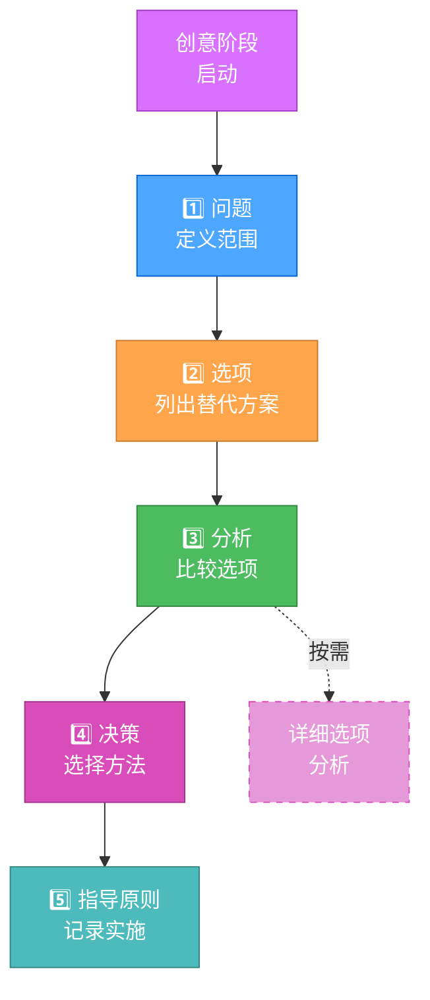
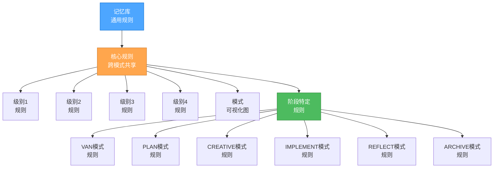

# 当前系统状态

> **简要说明：** 记忆库系统已演进为一个令牌优化的分层框架，具有即时规则加载、渐进式文档和跨模式转换的高效上下文保持功能。

## 🎯 核心系统优化

### 1. 分层规则加载
- 专门规则的即时（JIT）加载
- 跨模式转换的核心规则缓存
- 基于复杂度的规则选择
- 令牌使用的显著减少

### 2. 渐进式文档

### 3. 优化的模式转换
- 统一上下文传输协议
- 标准化转换文档
- 选择性上下文保持
- 改进模式间上下文保持

### 4. 增强的级别工作流程
- 级别1：快速修复的超紧凑模板
- 级别2：带简化模板的平衡4阶段工作流程
- 级别3：优化的创意阶段探索
- 级别4：企业项目的分层文档模板

### 5. 令牌优化架构

## 🔄 优化效率

### 模式特定优化
1. **VAN模式**
   - 以最小开销高效确定复杂度
   - 减少令牌使用的平台感知命令
   - 简化文件验证流程

2. **PLAN模式**
   - 复杂度适当的计划模板
   - 计划细节的渐进式披露
   - 任务组织的表格格式

3. **CREATIVE模式**
   - 带表格比较的渐进式文档
   - 创意探索的"按需详细"方法
   - 高效的选项分析模板

4. **IMPLEMENT模式**
   - 简化的实施指导
   - 级别适当的验证流程
   - 整合的状态跟踪

5. **REFLECT/ARCHIVE模式**
   - 上下文感知的审查机制
   - 高效的知识保持
   - 优化的文档格式

### 上下文管理改进
- 模式间统一上下文传输协议
- 关键信息的选择性保持
- 差异化记忆库更新以最小化令牌使用
- 模式特定的上下文压缩技术

## 📊 令牌效率改进

### 规则加载优化
- 高效导航的分层规则结构
- 规则依赖跟踪以防止冗余加载
- 基于复杂度级别的条件规则加载
- 跨模式转换的规则缓存

### 文档效率
- 复杂文档的渐进式披露模型
- 高效选项比较的表格格式
- 级别适当的文档扩展
- 最小样板的标准化模板

### 记忆库优化
- 差异化更新以最小化令牌使用
- 频繁访问信息的上下文压缩
- 跨模式的选择性同步
- 结构化知识组织

## 🎯 当前焦点

1. **架构完善**
   - 微调分层规则加载系统
   - 优化规则依赖和关系
   - 增强自适应复杂度模型

2. **文档增强**
   - 进一步优化每个级别的模板
   - 改进表格比较格式
   - 完善渐进式文档方法

3. **上下文保持**
   - 增强统一上下文传输协议
   - 改进转换文档效率
   - 开发更好的上下文修剪算法

4. **集成增强**
   - 加强优化组件间的协调
   - 改进优化的监控和指标
   - 开发更复杂的配置选项

## 🚀 下一步

1. **高级令牌优化**
   - 基于任务特征的动态模板生成
   - 长期任务的自动上下文摘要
   - 专门规则文件内的部分规则加载

2. **跨任务学习**
   - 相似任务间的知识保持
   - 通用解决方案模式存储库
   - 基于历史决策的智能建议系统

3. **工作流程自动化**
   - 基于任务状态的自动模式转换
   - 基于使用模式的智能规则选择
   - 工作流程期间的动态复杂度调整

4. **界面增强**
   - 带交互元素的改进可视化流程图
   - 更好的进度跟踪和可视化
   - 增强模式间转换指导

系统已针对令牌效率进行了显著优化，同时保持了原始方法的所有结构化开发优势。这些优化使更复杂的项目能够在令牌约束内有效处理，同时提供改进的用户体验。