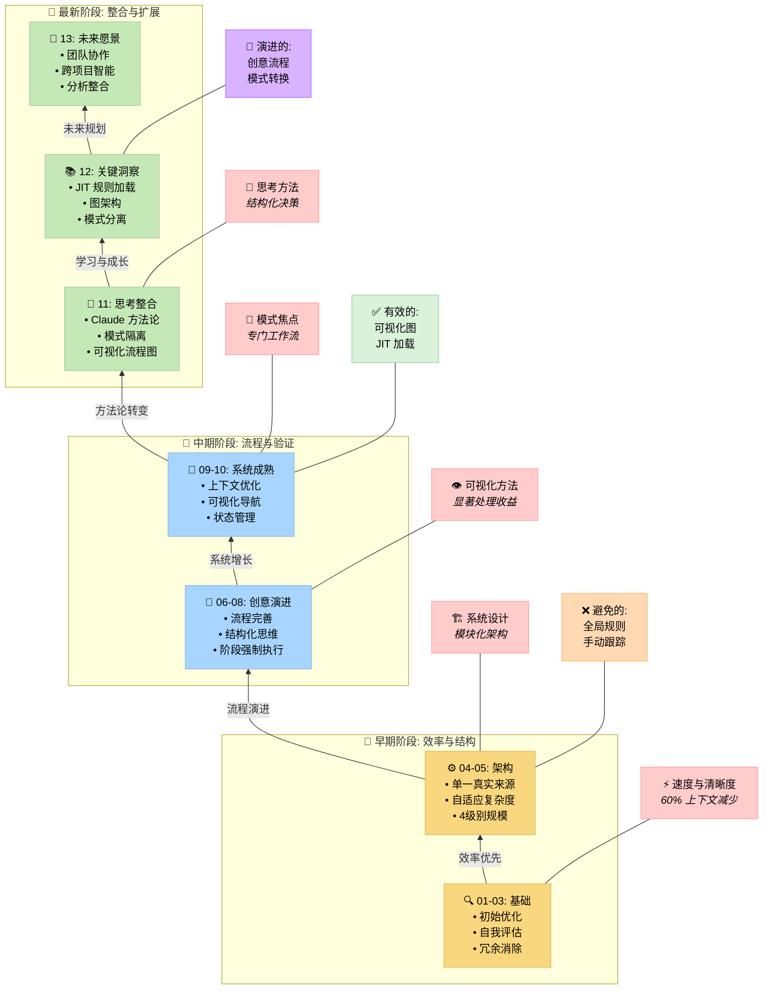

# 记忆库系统：优化之旅

> **简要说明：** 记忆库系统经历了多轮优化演进，从最初的效率改进到与 Claude 的"思考"工具的方法论整合。系统现在具有模式特定隔离、可视化流程图和模块化架构，能够实现可扩展的系统化开发，同时保持上下文效率。

## 📑 目录

| 文档 | 描述 |
|----------|-------------|
| [00-introduction.md](00-introduction.md) | 介绍和系统目的 |
| [01-efficiency-and-clarity.md](01-efficiency-and-clarity.md) | 优化轮次 1：效率与清晰度 |
| [02-system-self-assessment.md](02-system-self-assessment.md) | 优化轮次 2：系统自我评估 |
| [03-redundancy-elimination.md](03-redundancy-elimination.md) | 优化轮次 3：冗余消除 |
| [04-single-source-of-truth.md](04-single-source-of-truth.md) | 优化轮次 4：单一真实来源实现 |
| [05-adaptive-complexity-model.md](05-adaptive-complexity-model.md) | 优化轮次 5：自适应复杂度模型 |
| [06-self-assessment-recommendations.md](06-self-assessment-recommendations.md) | 优化轮次 6：自我评估建议 |
| [07-structured-creative-thinking.md](07-structured-creative-thinking.md) | 优化轮次 7：结构化创意思维 |
| [08-creative-phase-enforcement.md](08-creative-phase-enforcement.md) | 优化轮次 8：创意阶段强制执行与指标 |
| [09-context-optimization.md](09-context-optimization.md) | 优化轮次 9：通过可视化导航的上下文优化 |
| [10-current-system-state.md](10-current-system-state.md) | 当前系统状态 |
| [11-methodological-integration.md](11-methodological-integration.md) | 与 Claude 思考方法论的整合 |
| [12-key-lessons.md](12-key-lessons.md) | 关键经验教训 |
| [13-future-directions.md](13-future-directions.md) | 未来方向和扩展愿景 |

## 📋 优化之旅概览

本文档详细记录了记忆库系统通过几个关键阶段的演进：

### 早期优化（轮次 1-5）
1. **效率与清晰度**：解决冗长问题并改进视觉层次
2. **系统自我评估**：添加验证机制并改进跟踪
3. **冗余消除**：创建集中式任务注册表和领域分离
4. **单一真实来源**：为任务跟踪实现真正的单一来源
5. **自适应复杂度模型**：为不同任务引入四个复杂度级别

### 流程完善（轮次 6-9）
6. **自我评估建议**：增强创意阶段处理并简化流程
7. **结构化创意思维**：为级别 3-4 任务强制要求创意阶段
8. **创意阶段强制执行**：实现硬网关和质量指标
9. **上下文优化**：添加选择性文档加载和可视化导航

### 最新发展（轮次 10-13）
10. **系统状态评估**：优化的综合评估
11. **方法论整合**：与 Claude 思考工具方法论的对齐
12. **关键经验整合**：关键洞察的综合
13. **未来方向**：扩展和协作的愿景

## 🔍 最新系统成就

最近的发展取得了显著改进：

- **方法论整合**：与 Claude 的"思考"工具方法论对齐
- **模式隔离**：规则在特定模式内的严格包含
- **可视化流程图**：通过开发阶段的全面指导
- **即时加载**：通过选择性规则加载优化上下文使用
- **基于图的架构**：高效的决策树导航和资源优化

## 🧠 记忆库系统核心原则

系统现在维护这些增强的核心原则：

1. **方法论基础**：基于经过验证的方法论的结构化方法
2. **模式特定隔离**：通过专门模式清晰分离关注点
3. **可视化处理**：全面的流程图和决策树
4. **即时效率**：在需要时只加载所需内容
5. **持续演进**：系统的定期评估和改进

## 开发阶段概览

### 早期焦点（章节 1-5）
- 建立了基础效率原则
- 开发了系统化的开发方法
- 创建了核心架构和复杂度模型

### 中期阶段（章节 6-10）
- 完善了创意流程和强制执行
- 实现了可视化处理技术
- 实现了显著的上下文优化

### 最新阶段（章节 11-13）
- 与 Claude 的"思考"方法论整合
- 实现了严格的模式特定隔离
- 建立了未来扩展的愿景

记忆库系统继续作为个人爱好项目演进，专注于为结构化开发创建强大工具，同时保持在其演进过程中被证明有效的核心 4 级复杂度规模。
